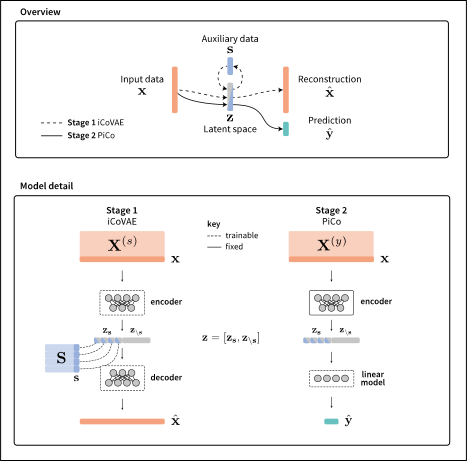

<h1 align="center">Prediction with interpretable Constraints (PiCo)</h1>

Official code for [Interventionally-guided representation learning for robust and interpretable AI models in cancer medicine](https://www.biorxiv.org/content/10.1101/2025.07.21.662350).

## Introduction

PiCo leverages constrained representation learning to improve robustness and interpretability in high-dimensional machine learning models. This work shows that robust and interpretable predictions for a downstream task can be made by generating representations of some high-dimensional input data which are linked to auxiliary targets.

## Rationale

Many techniques for prediction from high-dimensional data either implicitly (through deep learning) or explicitly (through PCA, factor analysis etc.) use dimensionality reduction prior to fitting prediction models. This results in an unbiased compression of information in the input, preserving the largest sources of variance in the input. In many cases in biology, we have some prior on what information should be preserved in our low-dimensional representation for good prediction on a downstream task. It is popular to use priors derived from public databases for this. We take a different approach, using a data-driven method to preserve information related to auxiliary targets in representations, which is captured in an interpretable way for use in downstream tasks.

We specifically study the use of PiCo in a cancer biology setting, using gene expression data as the input and CRISPR knockout effect data as the auxiliary data. Then, we use representations generated using this data for downstream tasks such as drug response prediction in cancer cell lines and treatment response in patients.

## Installation

Code has been tested on `Python 3.9.12` with `PyTorch 2.0.1`, with `CUDA 11.8` and `CUDNN 8.9`. We make use of `torch.compile` to speed up model training, so require `Pytorch >= 2.0.0`.

Clone the repository:

    git clone https://github.com/domkirkham/pico.git

Create a `conda` environment:

    conda create --name pico python=3.9.12 -y
    conda activate pico

Install dependencies:

    # Install torch for CUDA 11.8
    pip install torch==2.0.1 torchvision==0.15.2 torchaudio==2.0.2 --index-url https://download.pytorch.org/whl/cu118
    # Install other dependencies
    pip install -r requirements.txt

## Running PiCo with your own data

The PiCo framework requires three data objects:

1. `x`: Input data *e.g. gene expression*
2. `s`: Auxiliary data *e.g. CRISPR response*
3. `y`: Target data *e.g. drug response*

To use the framework with new data, create a function in `src/utils/data_utils.py` which loads the required data and returns `x`, `s`, `y`, and produces a list `test_samples`, based on some `experiment` name. These should be of type `pd.DataFrame`, with `index` (rows) set as sample identifiers which are shared across `x`, `s` and `y`, so that the datasets can be split accordingly. Examples can be seen in `src/utils/data_utils.py`, named `process_depmap_gdsc` and `process_depmap_gdsc_transneo`. If no `test_samples` is defined, a list of random samples will be selected.

After this, add a line to the function `process_data` in `src/utils/data_utils.py` corresponding to your new dataset.

All that needs to be done after this is to run `icovae_hopt.py`. For a new dataset, it is necessary to specify the constraints using the command line argument `-constraints`, which should correspond to column names in `s`. For an example of a more flexible/automatic selection of constraints see the use of the `get_constraints` function in `icovae_hopt.py`.

When this is complete, run `pico_sk_hopt.py`, specifying your chosen dataset and experiment using the command line arguments `-dataset` and `-experiment` for both scripts. This will run a hyperparameter optimisation for your data and refit the best model, then generate predictions on the test data defined by `test_samples`. In this stage, it is possible to include additional features for prediction alongside the representations, as is done for the patient data in our paper. These are included through an additional object `c` and another command line argument `--confounders`. See the function `process_depmap_gdsc_transneo` for a reference, and `schedule_jobs.py` for example CLI usage and scripts to submit batches of jobs using SLURM.

## Examples

### Out-of-distribution (OOD) prediction on cancer cell lines

See `results_analysis/ccl_drug_resp.ipynb`.

### Transfer from cell line experimental data to patient treatment response

See `results_analysis/transneo_treatment_resp.ipynb`.

### Data availability

| Dataset | Version | Link |
| ----- | ----- | ----- |
| DepMap | 23Q2 | [DepMap](https://depmap.org/portal/data_page/?tab=allData) |
| GDSC2 | Oct 2023 | [GDSC2](https://cancerrxgene.org/downloads/bulk_download) |
| TransNEO & ARTemis+PBCP | - | (i) [RNA-Seq](https://github.com/cclab-brca/neoadjuvant-therapy-response-predictor) (ii) [Response](https://github.com/micrisor/NAT-ML/tree/main) |

## Contents

[results_analysis](./results_analysis): Contains notebooks for analysing results and producing figures from the paper

[src/models](./src/models): Contains model classes for iCoVAE and PiCo

## FAQ

Please raise issues in the repository or email dom.kirkham@mrc-bsu.cam.ac.uk.

## Citation

If you find this work interesting or use the code here, please cite our paper:

    @misc{kirkham_interventionally-guided_2025,
        title = {Interventionally-guided representation learning for robust and interpretable AI models in cancer medicine},
        copyright = {© 2025, Posted by Cold Spring Harbor Laboratory. This pre-print is available under a Creative Commons License (Attribution 4.0 International), CC BY 4.0, as described at http://creativecommons.org/licenses/by/4.0/},
        url = {https://www.biorxiv.org/content/10.1101/2025.07.21.662350},
        doi = {10.1101/2025.07.21.662350},
        language = {en},
        urldate = {2025-07-22},
        publisher = {bioRxiv},
        author = {Kirkham, Dom and Masina, Riccardo and Sammut, Stephen-John and Mukherjee, Sach and Rueda, Oscar M.},
        month = jul,
        year = {2025},
    }

