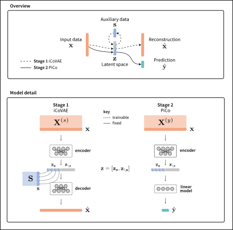

<h1 align="center">Prediction with interpretable Constraints (PiCo)</h1>

Official code for [Interventionally-guided representation learning for robust and interpretable AI models in cancer medicine](https://www.biorxiv.org/content/10.1101/2025.07.21.662350).

## Introduction

PiCo leverages constrained representation learning to improve robustness and interpretability in high-dimensional machine learning models. This work shows that robust and interpretable predictions for a downstream task can be made by generating representations of some high-dimensional input data which are linked to auxiliary targets.

## Rationale

Many techniques for prediction from high-dimensional data either implicitly (through deep learning) or explicitly (through PCA, factor analysis etc.) use dimensionality reduction prior to fitting prediction models. This results in an unbiased compression of information in the input, preserving the largest sources of variance in the input. In many cases in biology, we have some prior on what information should be preserved in our low-dimensional representation for good prediction on a downstream task. It is popular to use priors derived from public databases for this. We take a different approach, using a data-driven method to preserve information related to auxiliary targets in representations, which is captured in an interpretable way for use in downstream tasks.

We specifically study the use of PiCo in a cancer biology setting, using gene expression data as the input and CRISPR knockout effect data as the auxiliary data. Then, we use representations generated using this data for downstream tasks such as drug response prediction in cancer cell lines and treatment response in patients.

## 1. System requirements

### Software dependencies

All dependencies are pinned in [requirements.txt](requirements.txt):

    matplotlib==3.10.8
    numpy==2.4.2
    optuna==3.2.0
    pandas==1.4.1
    pyreadr==0.4.7
    scikit_learn==1.8.0
    scipy==1.17.0
    seaborn==0.13.2
    statsmodels==0.13.2
    torch==2.0.1+cu118
    tqdm==4.63.0
    umap_learn==0.5.6

### Versions tested

| Component | Version |
| --- | --- |
| Python | 3.9.12 |
| PyTorch | 2.0.1 |
| CUDA | 11.8 |
| cuDNN | 8.9 |
| OS (full training) | Linux RHEL 8.10 (kernel 4.18), Cambridge CSD3 Wilkes3 cluster |
| OS (demo notebooks) | Linux (Google Colab, Ubuntu 22.04); also tested on macOS 14 with PyTorch CPU-only |

PyTorch 2.0 or later is required because training uses `torch.compile` (a PyTorch feature that just-in-time compiles models for faster training).

### Hardware requirements

* **For the Colab / local demo notebooks (`demo/`):** CPU-only is sufficient; any machine with ≥ 8 GB RAM. No GPU required.
* **For reproducing full-paper training runs (hyperparameter optimisation, 10 seeds per setting):** an NVIDIA GPU with ≥ 16 GB memory and CUDA 11.8 support is required in practice. All paper results were generated on NVIDIA A100 (80 GB) GPUs.

## 2. Installation

Typical install time on a standard desktop (including downloading PyTorch CUDA wheels): **~5–10 minutes**.

If you only intend to run the demo notebooks on Colab, skip this section — the notebook's first cell installs everything needed.

### Local install

Clone the repository:

    git clone https://github.com/domkirkham/pico.git
    cd pico

Create a `conda` environment:

    conda create --name pico python=3.9.12 -y
    conda activate pico

Install dependencies:

    # Install torch (pick one)
    # GPU (CUDA 11.8) — required for full training:
    pip install torch==2.0.1 torchvision==0.15.2 torchaudio==2.0.2 --index-url https://download.pytorch.org/whl/cu118
    # CPU-only — sufficient for the demo notebooks:
    pip install torch==2.0.1 torchvision==0.15.2 torchaudio==2.0.2 --index-url https://download.pytorch.org/whl/cpu
    # Install the rest
    pip install -r requirements.txt

## 3. Demo

Two self-contained Jupyter notebooks reproduce the headline figures of the paper end-to-end on CPU. The pretrained iCoVAE / VAE encoders and a small preprocessed slice of DepMap / GDSC / TransNEO are included directly in this repository under [demo/assets/](demo/assets/) (~460 MB total), so no external downloads are required. The notebooks call the **paper's exact plotting code** (extracted into [demo/plot_helpers.py](demo/plot_helpers.py) from `results_analysis/*.ipynb` cells 39, 42, 43, 54), with the same Source Sans 3 typography as the published figures.

| Notebook | Open | Reproduces | Expected runtime (CPU) |
| --- | --- | --- | --- |
| [demo/demo_ccl.ipynb](demo/demo_ccl.ipynb) |  | **Fig. 3** (drug-response performance, both the aggregated boxplot and the per-drug pointplot) and **Fig. 4** (permutation feature importance) for four headline drugs: AZD6738, trametinib, oxaliplatin, 5-fluorouracil | ~3 min |
| [demo/demo_transneo.ipynb](demo/demo_transneo.ipynb) |  | **Fig. 5c** (RCB regression two-panel CV + ARTemis+PBCP pointplot across all six paper feature sets), **Fig. 5d** (pCR classification, same shape), and the Clinical+z+RNA permutation feature importance panels | ~2 min |

The CCL notebook also includes a **live-encoding reproducibility check** that loads each iCoVAE / VAE encoder, re-encodes gene expression on CPU, refits the standardiser + ElasticNet prediction head with the saved per-seed hyperparameters, and confirms bit-identity (max abs diff ≈ 1e-6) against the cached `z_pred_test_s{seed}.csv` files used to make the paper's figures.

### Running the demo on Google Colab (recommended)

Click either Colab badge at the top of this README. Each notebook starts with a `pip install` cell that sets up the environment; subsequent cells clone the repo, load the included pretrained encoders and preprocessed data, run the live-encoding reproducibility check (CCL only), aggregate metrics via the paper's performance-comparison utility (`PerfComp.calculate_perf` in `src/utils/comp_utils.py`), then plot via `demo/plot_helpers.py`.

### Running the demo locally

After completing the local install above:

    jupyter lab demo/demo_ccl.ipynb
    # or
    jupyter lab demo/demo_transneo.ipynb

### Expected output

Each notebook prints aggregated metric tables and saves figures (PNG + SVG, dpi 600) into `demo/outputs/`:

* **`demo_ccl.ipynb`** — Spearman ρ of predicted vs observed log(IC50) on held-out cancer types, by drug × feature extractor. Expected numbers across the 10 included seeds (mean ± s.d.; the figures themselves reproduce slices of Fig. 3 of the paper):

  | Drug | PiCo | VAE |
  | --- | --- | --- |
  | AZD6738 (ceralasertib) | **0.45 ± 0.03** | 0.31 ± 0.03 |
  | Trametinib | **0.37 ± 0.04** | 0.33 ± 0.04 |
  | Oxaliplatin | **0.55 ± 0.001** | 0.46 ± 0.03 |
  | 5-Fluorouracil | **0.32 ± 0.01** | 0.24 ± 0.05 |

  Plus a permutation-feature-importance bar plot per drug (Fig. 4b–e), labelled by constraint gene (e.g. z_ITGB5, z_RAD17 for AZD6738; z_MDM4, z_TTF2 for oxaliplatin).

* **`demo_transneo.ipynb`** — RCB Spearman correlation and pCR AUROC on the ARTemis+PBCP external validation cohort, across all six paper feature sets. Expected numbers (matching Fig. 5c,d):

  | Metric | PiCo Clinical+z+RNA | VAE Clinical+z+RNA | Clinical+RNA (no z) | Clinical only |
  | --- | --- | --- | --- | --- |
  | RCB Spearman ρ | ~0.76 | ~0.74 | ~0.78 | ~0.59 |
  | pCR AUROC | ~0.91 | ~0.89 | ~0.89 | ~0.74 |

  Plus permutation-feature-importance panels for the Clinical+z+RNA model showing z_TP53 / *ESR1* expression / taxane score for RCB and z_ERBB2 / age / *PGR* expression for pCR.

### What's included

The [demo/assets/](demo/assets/) folder contains the exact files the paper notebooks read from `data/outputs/`, restricted to the demo's 4 drugs × 10 seeds × {iCoVAE, VAE} × 6 feature sets (TransNEO). Filenames match the training-script output convention so that re-running the training pipeline from `src/scripts/` writes new files into the same directories — the included ones are simply a subset of what a full re-run produces. The whole [demo/assets/](demo/assets/) folder can be regenerated from scratch via [scripts/build_demo_bundle.py](scripts/build_demo_bundle.py).

## 4. Instructions for use

### 4.1 Running PiCo on your own data

The PiCo framework requires three data objects:

1. `x`: Input data *e.g. gene expression*
2. `s`: Auxiliary data *e.g. CRISPR gene effect*
3. `y`: Target data *e.g. drug response*

To use the framework with new data, add a function to [src/utils/data_utils.py](src/utils/data_utils.py) which loads your data and returns `x`, `s`, `y`, and a list `test_samples`. These should be of type `pd.DataFrame`, with `index` set as sample identifiers shared across `x`, `s`, and `y`. Examples: [`process_depmap_gdsc`](src/utils/data_utils.py) and [`process_depmap_gdsc_transneo`](src/utils/data_utils.py). If `test_samples` is empty, random samples are held out.

Then add a line to `process_data` in the same file corresponding to your new dataset.

Fit the iCoVAE (stage 1):

    python src/scripts/icovae_hopt.py \
        -dataset <your_dataset> \
        -target <drug_or_outcome> \
        -constraints GENE1 GENE2 ... \
        --experiment <experiment_name> \
        --cuda

(For automatic constraint selection rather than a fixed list, see [`get_constraints`](src/utils/data_utils.py) and the example cluster-submission script at [`docs/examples/slurm/icovae_hopt.sh`](docs/examples/slurm/icovae_hopt.sh).)

Fit a PiCo prediction head (stage 2):

    python src/scripts/pico_sk_hopt.py \
        -dataset <your_dataset> \
        -target <drug_or_outcome> \
        --experiment <experiment_name> \
        --cuda

The second stage accepts additional features via an optional `c` object and `--confounders` flag, as used for the TransNEO clinical/RNA features.

### 4.2 Reproducing paper results

The full training runs are GPU-only and reproducing each setting requires hyperparameter optimisation over 150 trials driven by the [Optuna](https://optuna.org) framework, followed by 10-seed refits; see the walltime estimate below.

| Paper figure | Script / notebook |
| --- | --- |
| Fig. 2 (representation richness) | [results_analysis/ccl_drug_resp.ipynb](results_analysis/ccl_drug_resp.ipynb) |
| Fig. 3 (out-of-distribution drug response, all drugs) | [src/scripts/icovae_hopt.py](src/scripts/icovae_hopt.py) + [src/scripts/pico_sk_hopt.py](src/scripts/pico_sk_hopt.py), submission via [src/scripts/schedule_jobs_depmap.py](src/scripts/schedule_jobs_depmap.py) and [src/scripts/schedule_jobs_depmap_sk.py](src/scripts/schedule_jobs_depmap_sk.py); aggregation in [results_analysis/ccl_drug_resp.ipynb](results_analysis/ccl_drug_resp.ipynb) |
| Fig. 4 (permutation feature importance, cell lines) | [results_analysis/ccl_drug_resp.ipynb](results_analysis/ccl_drug_resp.ipynb) |
| Fig. 5 (TransNEO RCB / pCR) | [src/scripts/schedule_jobs.py](src/scripts/schedule_jobs.py); aggregation and figures in [results_analysis/transneo_treatment_resp.ipynb](results_analysis/transneo_treatment_resp.ipynb) |
| Supp. Figs B1–B4 | Same pipelines as above; rendering in the notebooks listed. |

On a single NVIDIA A100 GPU, the stage-1 iCoVAE hyperparameter optimisation for the DepMap/GDSC data (1500 features, ~1000 samples, 150 Optuna trials, 300 epochs per trial) takes approximately **8 hours**. Stage-2 PiCo head fitting and refit across 10 seeds takes ~15 min per drug. Full reproduction of the 65-drug cell-line experiment is therefore ≳ 200 GPU-hours.

### 4.3 Examples

* **Hyperparameter-optimisation process** — [docs/examples/slurm/icovae_hopt.sh](docs/examples/slurm/icovae_hopt.sh) and the `schedule_jobs*.py` scripts under `src/scripts/` (these submit training jobs to a SLURM HPC cluster; see the [SLURM templates README](docs/examples/slurm/README.md) for site-specific edits).
* **Out-of-distribution (OOD) prediction on cancer cell lines** — [results_analysis/ccl_drug_resp.ipynb](results_analysis/ccl_drug_resp.ipynb).
* **Transfer from cell-line experimental data to patient treatment response** — [results_analysis/transneo_treatment_resp.ipynb](results_analysis/transneo_treatment_resp.ipynb).

## Data availability

| Dataset | Version | Link |
| --- | --- | --- |
| DepMap | 23Q2 | [DepMap](https://depmap.org/portal/data_page/?tab=allData) |
| GDSC2 | Oct 2023 | [GDSC2](https://cancerrxgene.org/downloads/bulk_download) |
| TransNEO & ARTemis+PBCP | — | (i) [RNA-Seq](https://github.com/cclab-brca/neoadjuvant-therapy-response-predictor) (ii) [Response](https://github.com/micrisor/NAT-ML/tree/main) |

The data and pretrained encoders included under [demo/assets/](demo/assets/) are derived from the DepMap, GDSC2, and TransNEO/ARTemis+PBCP sources above. The build script that produced them ([scripts/build_demo_bundle.py](scripts/build_demo_bundle.py)) shows the exact selection / preprocessing applied to each file.

## Repository contents

| Path | Description |
| --- | --- |
| [demo/](demo/) | Two Colab/local demo notebooks (`demo_ccl.ipynb`, `demo_transneo.ipynb`) plus the pretrained encoders and small preprocessed data they read from `assets/` |
| [demo/plot_helpers.py](demo/plot_helpers.py) | Shared module of plotting + loading functions, lifted near-verbatim from the paper analysis notebooks (cells 39, 42, 43, 54) |
| [results_analysis/](results_analysis/) | Notebooks used to produce the figures in the paper |
| [src/](src/) | Core PiCo package (see [src/README.md](src/README.md) for a directory map) |
| [src/models/](src/models/) | `iCoVAE` and `PiCo` model classes |
| [src/scripts/](src/scripts/) | Training / hyperparameter-optimisation entry points |
| [scripts/](scripts/) | Demo-build utilities (`build_demo_bundle.py`, `build_demo_notebooks.py`) |
| [src/utils/](src/utils/) | Data-loading and comparison utilities (`PerfComp`, `calculate_feat_imps`, etc.) |
| [docs/examples/slurm/](docs/examples/slurm/) | Example SLURM submission templates for full training runs on a Cambridge CSD3 Wilkes3-style cluster |
| [MODEL_CARD.md](MODEL_CARD.md) | Model card (intended use, training data, evaluation, limitations, environmental impact) |

## FAQ

Please raise issues in the repository or email <dom.kirkham@mrc-bsu.cam.ac.uk>.

## Citation

If you find this work interesting or use the code here, please cite our paper:

    @misc{kirkham_interventionally-guided_2025,
        title = {Interventionally-guided representation learning for robust and interpretable AI models in cancer medicine},
        copyright = {© 2025, Posted by Cold Spring Harbor Laboratory. This pre-print is available under a Creative Commons License (Attribution 4.0 International), CC BY 4.0, as described at http://creativecommons.org/licenses/by/4.0/},
        url = {https://www.biorxiv.org/content/10.1101/2025.07.21.662350},
        doi = {10.1101/2025.07.21.662350},
        language = {en},
        urldate = {2025-07-22},
        publisher = {bioRxiv},
        author = {Kirkham, Dom and Masina, Riccardo and Sammut, Stephen-John and Mukherjee, Sach and Rueda, Oscar M.},
        month = jul,
        year = {2025},
    }
